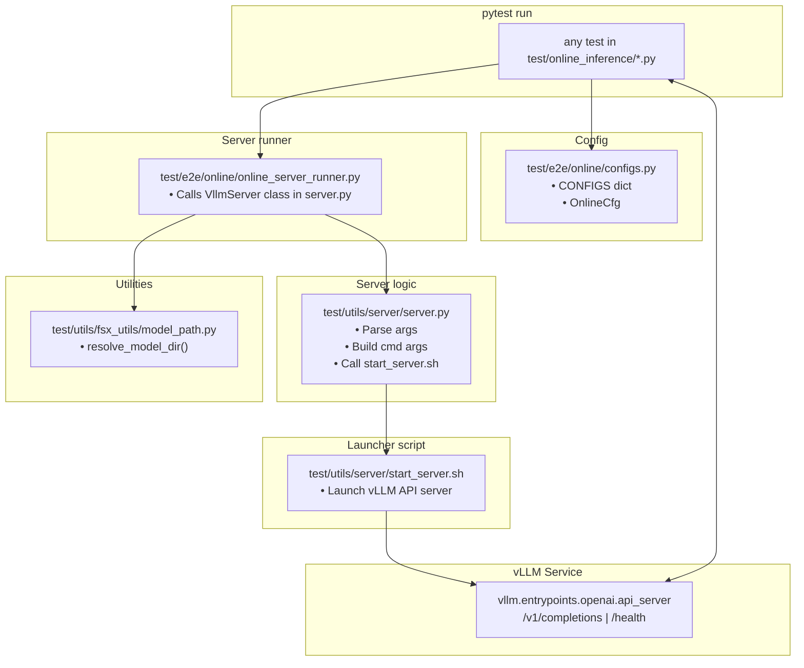

# Online Inference E2E Test Suite

This directory contains **end-to-end tests** for running vLLM in *online inference* mode on AWS Neuron.  
Unlike offline/batch tests, these spin up a live HTTP service (`/v1/completions`) and interact with it via real API calls.

---

## Directory Structure

```
test/
├── e2e/
│   └── online/
│       ├── configs.py                   # Named presets: model path, TP, batch size, ports, token settings, etc.
│       ├── online_server_runner.py      # Spins up/tears down vLLM server (VllmServer)
│       ├── test_online_e2e.py           # Consolidated e2e tests (vanilla, eagle, qwen, tool calling, reasoning)
│       └── test_online_multi_lora.py    # Multi-LoRA specific e2e test
├── tiny/
│   └── test_vanilla_inference_tiny.py   # Tiny/smoke test for PR suite
└── utils/
    ├── fsx_utils/
    │   └── model_path.py             # resolve_model_dir(): FSX → SSD (if writable) path resolver
    └── server/
        ├── server.py        # Defines VllmServer (server spin-up logic)
        └── start_server.sh # Thin wrapper around vllm.entrypoints.openai.api_server
```

---

## Architecture (applies to all online inference)



---

## End-to-End Flow (All Tests)

1. **Test file** (`test/e2e/online/test_online_e2e.py`)  
   Loads a config (from `configs.py`) specifying:
   - `model` (model path or identifier)
   - `tp_degree`, `batch_size`, `max_tokens`, ports
   - Optional online features: prefix caching, chunked prefill, LoRA, etc.

2. **Server runner** (`online_server_runner.py`)  
   - Resolves model directory (`resolve_model_dir()` in `fsx_utils/model_path.py`)
   - Builds CLI flags & environment
   - Launches `start_server.sh` in a subprocess

3. **Server logic** (`server.py`)  
   - Defines the `VllmServer` class used by `online_server_runner.py`  
   - Handles:
     - Building the complete vLLM server CLI command  
     - Configuring environment variables (e.g., Neuron-specific flags)  
     - Managing process lifecycle (start, health-check, terminate)  
     - Special handling for optional features:
       - Prefix caching  
       - Chunked prefill  
       - Quantization (pre-quantized checkpoints)
       - Multi LoRA
       - Any other features we will host in future..  
   - Interfaces with `start_server.sh` to actually launch the process  

4. **Launcher** (`start_server.sh`)  
   - Calls `python -m vllm.entrypoints.openai.api_server`
   - Passes TP, batch size, max tokens, and optional flags
   - Starts HTTP server (default port `8000` unless overridden)

5. **Service**  
   - Exposes `/health` and `/v1/completions`
   - Runs model inference using Neuron-backed vLLM

6. **Test logic**  
   - Waits for `/health` to report ready
   - Sends one or more prompts to `/v1/completions`
   - Validates output (content checks, latency checks, shape checks)
   - Tears down the server process

---

## Running Tests

### Local

```bash
pytest -s test/e2e/online/test_online_e2e.py
```

### With a specific config

```bash
ONLINE_CONFIG=autotest pytest -s test/e2e/online/test_online_e2e.py
```

---

## Extending the Suite

- Add new configs in `test/e2e/online/configs.py`
- Add new test functions to `test/e2e/online/test_online_e2e.py`
- Use `VllmServer` helper to avoid duplicating server lifecycle logic
- Keep model resolution via `fsx_utils/model_path.py` to ensure FSx/SSD routing stays consistent

---

## License

SPDX-License-Identifier: **Apache-2.0**
